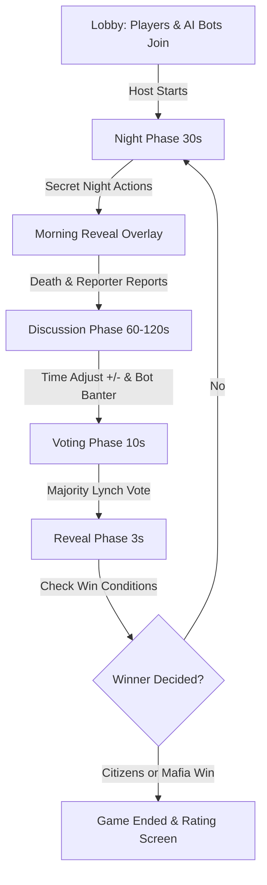

# 🚀 Nimbus 2K26 – Official Festival & Mafia Game App

> The official mobile application for **Nimbus 2K26**, the annual national-level technical festival of **NIT Hamirpur**. Features a complete festival companion (events, interactive timeline, club profiles, and community chats) alongside an advanced **real-time multiplayer Mafia social deduction game** driven by intelligent, adaptive AI bots and WebSockets.

---

## 📑 Table of Contents
- [✨ Key Features](#-key-features)
- [🎭 Mafia: The Social Deduction Game](#-mafia-the-social-deduction-game)
  - [Game Roles Matrix](#game-roles-matrix)
  - [Room Sizes & Role Compositions](#room-sizes--role-compositions)
  - [Game Loop & Phases](#game-loop--phases)
  - [🧠 Intelligent AI Bot Engine](#-intelligent-ai-bot-engine)
- [🎪 Festival Companion Features](#-festival-companion-features)
- [🛠️ Technology Stack](#️-technology-stack)
- [📐 Architecture & Real-Time Flow](#-architecture--real-time-flow)
- [📱 Getting Started](#-getting-started)
  - [Prerequisites](#prerequisites)
  - [Setup & Run](#setup--run)
  - [Android Build & Run](#android-build--run)
- [📂 Project Directory Structure](#-project-directory-structure)
- [🤝 Contributing & Authors](#-contributing--authors)

---

## ✨ Key Features

* **Multiplayer Real-Time Mafia Game**: Custom lobby creation, quick match-making, private room codes, and seamless Pusher WebSocket state synchronization.
* **Autonomous & Adaptive AI Bots**: Intelligent bots auto-fill incomplete rooms, engage in realistic multi-stage debates, deceive town if Mafia, listen to human players, and dynamically vote consensus targets.
* **Interactive Day Timeline**: Day 1, Day 2, and Day 3 festival schedule browser with category filtering, live event badges, and venue details.
* **Clubs & Core Teams Showcase**: In-depth profiles of institutional and departmental clubs, student coordinators, and annual project galleries.
* **Community & Team Chat**: Real-time public and team-restricted chat rooms with keyboard overflow protection and instant delivery.
* **Futuristic Dark Aesthetics**: Deep indigo-violet cyberpunk UI with glassmorphism, responsive animations, and atmospheric audio scoring.

---

## 🎭 Mafia: The Social Deduction Game

The classic social deduction party game reimagined as a competitive online mobile experience for **5, 8, or 12 players**.

### Game Roles Matrix

| Role | Team | Phase Action | Special Ability / Win Condition |
| :--- | :--- | :--- | :--- |
| **Mafia** 🔫 | Mafia | Night Target | Votes with fellow Mafia on which citizen to eliminate each night. Has private night chat. |
| **Mafia Helper** 🤝 | Mafia | Passive / Mafia Vote | Blends in as innocent. Learns fellow mafia members and votes with the syndicate. |
| **Hitman** 🎯 | Mafia / Neutral | Strike Early | Can guess roles of 2 targets at night. If both are correct, executes an early strike. Meets Mafia if target is hit. |
| **Doctor** 💉 | Citizens | Night Save | Protects one player each night from elimination (can self-heal). |
| **Nurse** 🩺 | Citizens | Night Check | Searches for the Doctor. Once Doctor and Nurse discover each other, they unlock private medical team chat! |
| **Cop** 🔍 | Citizens | Investigation | Investigates one player per night to reveal if they are Mafia or Citizen. |
| **Bounty Hunter** 🏹 | Citizens | VIP Tracking | Has a secret VIP target. If the VIP dies, the Bounty Hunter unlocks a direct kill against Mafia. |
| **Reporter** 📰 | Citizens | Broadcast | Can investigate a role and broadcast breaking news publicly to all players during morning report. |
| **Prophet** 🔮 | Citizens | Day-4 Win | If the Prophet survives until Day 4, Citizens win immediately! Mafia cannot win while Prophet lives. |
| **Citizen** 🧑‍🌾 | Citizens | Day Discussion & Vote | Relies on keen deduction, chat debate, and coordinated voting to eliminate all Mafia members. |

---

### Room Sizes & Role Compositions

* **5 Players**: 1 Mafia, 1 Doctor, 1 Cop, 2 Citizens. *(Fast-paced introductory mode)*
* **8 Players**: 2 Mafia, 1 Doctor, 1 Cop, 1 Bounty Hunter, 3 Citizens.
* **12 Players**: 2 Mafia, 1 Mafia Helper, 1 Hitman, 1 Doctor, 1 Nurse, 1 Cop, 1 Bounty Hunter, 1 Reporter, 1 Prophet, 2 Citizens.

---

### Game Loop & Phases



1. **Lobby**: Create or join rooms via 6-character room codes. If host starts with fewer players than required, **AI bots automatically fill empty slots**.
2. **Night Phase (30s)**: Secret role actions:
   * Mafia selects target (with dedicated **private-mafia chat**).
   * Doctor chooses who to heal.
   * Cop investigates suspects.
   * Hitman makes role deduction guesses.
3. **Morning Reveal (3-5s)**: Cinematic reveal showing who survived or fell in the night, accompanied by breaking news from the Reporter.
4. **Discussion Phase (60–120s)**:
   * Real-time global discussion chat.
   * Dynamic timer adjustment: players can vote `+` or `−` to adjust day discussion time.
   * Bots initiate strategic accusations, debate theories, and build consensus.
5. **Voting Phase (10s)**: All alive players lock in their day-lynch vote.
6. **Reveal & Elimination**: Most-voted player is eliminated, and their role status is updated.

---

### 🧠 Intelligent AI Bot Engine

The bot engine runs on the backend heartbeat and exhibits lifelike, tactical gameplay:

* **Adaptive Listening**: Bots actively parse messages sent by human players. If a human player says:
  * *"I think Karan is mafia"* or *"Vote Bot Riya"* $\rightarrow$ Citizen bots validate the player's reasoning, acknowledge the player by name (`@[PlayerName]`), update the town's prime suspect, and rally the room to support the player's vote.
  * *"Aarav is innocent"* $\rightarrow$ Bots take that player off the suspect list.
  * *"Who is mafia?"* or *"Who to vote?"* $\rightarrow$ Bots state their current prime suspect and invite the player's input.
* **Mafia Deception & Deflection**: Mafia bots never reveal their allegiance in global chat. Instead, they act like innocent citizens, frame other townies, deflect accusations away from fellow Mafia members, and coordinate targets secretly in the private night chat.
* **Human-Centric Pacing**: Discussion contributions occur with natural 10–16 second gaps, ensuring the player has comfortable time to read, think, and participate.
* **Consensus-Driven Voting**: In the voting phase, Citizen bots vote unitedly for the suspect agreed upon during discussion, while Mafia bots protect teammates if accused.

---

## 🎪 Festival Companion Features

* **Event Timeline**: Explore workshops, hackathons, guest lectures, robotics competitions, and cultural nights across Day 1, Day 2, and Day 3.
* **Live Event Notifications**: Instant updates and announcements for ongoing and upcoming sessions.
* **Club Profiles**: Comprehensive showcase of departmental societies (OSTELLO, C-SOC, MEDS, etc.) and festival clubs with member rosters and event schedules.
* **Community Hub**: Public chat channels allowing attendees, students, and participants to connect in real time.

---

## 🛠️ Technology Stack

### Frontend (Mobile App)
* **Framework**: [Flutter](https://flutter.dev/) (Dart 3.9+)
* **State Management**: `provider` (MultiProvider, ChangeNotifier)
* **Real-time WebSockets**: `pusher_channels_flutter`
* **Audio**: `audioplayers` (Custom morning reveal and night soundscapes)
* **Networking**: `http` with JWT bearer authentication
* **Storage**: `shared_preferences`

### Backend
* **Runtime**: [Node.js](https://nodejs.org/) (ES Modules)
* **Framework**: [Express.js](https://expressjs.com/)
* **ORM & Database**: [Prisma ORM](https://www.prisma.io/) with [PostgreSQL](https://www.postgresql.org/) (hosted on Render)
* **Real-Time Engine**: [Pusher Channels](https://pusher.com/)
* **Auth**: Firebase Admin SDK & Google OAuth2, JWT

---

## 📐 Architecture & Real-Time Flow

```
┌─────────────────────────────────┐           ┌─────────────────────────────────┐
│     Nimbus Flutter App (Client) │           │      Nimbus Backend (Render)     │
│                                 │           │                                 │
│  - Mafia Game Controller        │  REST API │  - Game & Lobby Controllers     │
│  - Pusher Client Service        │──────────>│  - Bot Discussion Service       │
│  - Event & Timeline Provider    │           │  - Night & Vote Resolve Service │
│  - Community Chat Provider      │           │  - Prisma ORM + PostgreSQL      │
└─────────────────────────────────┘           └─────────────────────────────────┘
                 ▲                                             │
                 │              Pusher WebSockets              │
                 └─────────────────────────────────────────────┘
                     Channels:
                      • game-{roomCode} (Public Game Events)
                      • private-mafia-{roomCode} (Mafia Team Chat)
                      • private-doc-{roomCode} (Medical Team Chat)
                      • private-{userId} (Secret Role Assignments)
```

---

## 📱 Getting Started

### Prerequisites
* [Flutter SDK](https://docs.flutter.dev/get-started/install) (`>= 3.24.0`)
* [Android Studio](https://developer.android.com/studio) or VS Code with Flutter extension
* Android Device or Emulator with Developer Options & USB Debugging enabled

### Setup & Run

1. **Clone the repository**:
   ```bash
   git clone https://github.com/appteam-nith/Nimbus-2k26-Frontend.git
   cd Nimbus-2k26-Frontend
   ```

2. **Install Flutter packages**:
   ```bash
   flutter pub get
   ```

3. **Check connected devices**:
   ```bash
   flutter devices
   ```

4. **Run the app**:
   ```bash
   flutter run
   ```

   *If compiling for Android with strict dependency checks, use:*
   ```bash
   flutter run --android-skip-build-dependency-validation
   ```

---

## 📂 Project Directory Structure

```
Nimbus-2k26-Frontend/
├── android/                   # Android native configuration & Gradle scripts
├── assets/                    # Audio files, icons, logos, and illustrations
│   └── audio/                 # Background music & sound effects
├── lib/
│   ├── chat/                  # Community & global festival chat
│   ├── mafia/                 # Complete Mafia Game Module
│   │   ├── controller/        # GameController (State, timers, actions)
│   │   ├── models/            # Role, Room, Player, Vote, and Chat models
│   │   ├── screens/           # Lobby, Night, Discussion, and End screens
│   │   ├── services/          # GameApi and PusherService (WebSockets)
│   │   └── widgets/           # ChatWidget, LinearTimer, RoleBoard, DeathCard
│   ├── models/                # Event, Club, and User data models
│   ├── providers/             # Authentication & global application state
│   ├── screens/               # Core festival pages, login, and home
│   ├── timeline/              # Festival 3-day timeline and event schedule
│   ├── app_colors.dart        # Unified festival color palette tokens
│   ├── theme.dart             # Dark futuristic app theme
│   └── main.dart              # Application entry point
├── pubspec.yaml               # Flutter package dependencies and assets
└── README.md                  # Project documentation
```

---

## 🤝 Contributing & Authors

Developed by the **App Team NITH** for **Nimbus 2K26**, National Institute of Technology Hamirpur.

Contributions, bug reports, and suggestions are welcome! Feel free to open an issue or submit a pull request.
